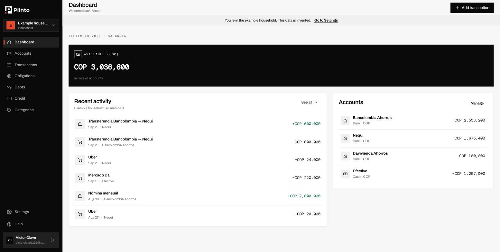
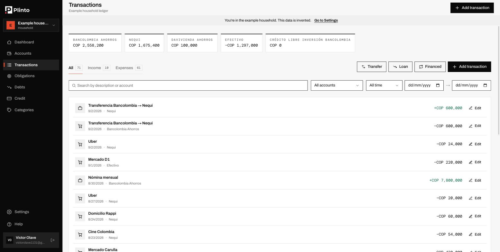
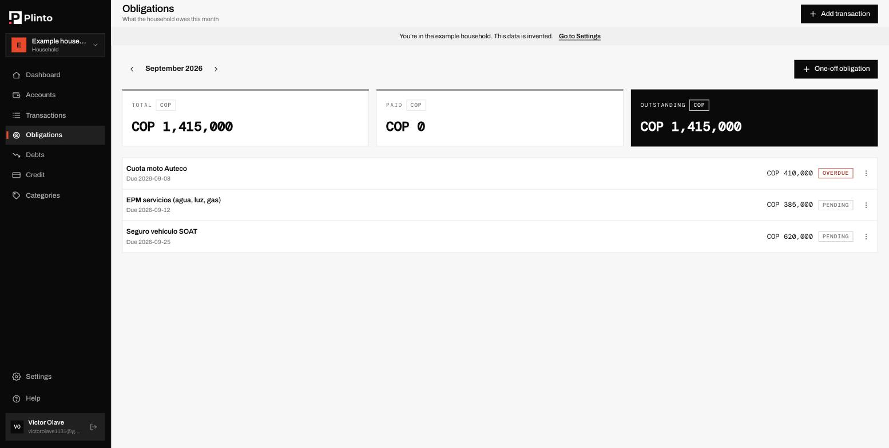
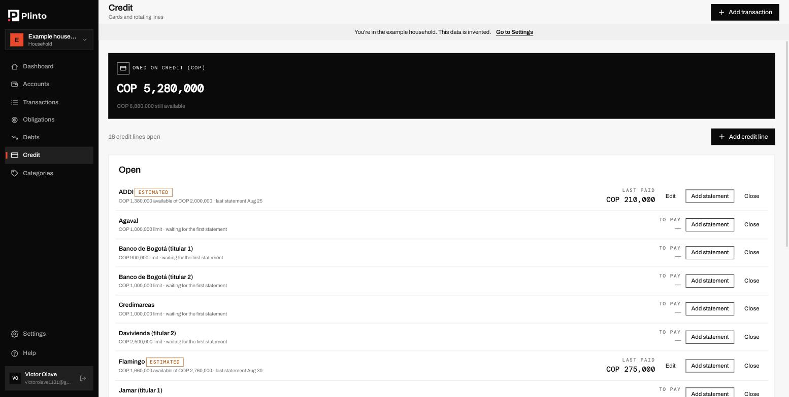

<div align="center">
  <picture>
    <source media="(prefers-color-scheme: dark)" srcset="assets/images/horizontal-white.png">
    
  </picture>
  
  <p><strong>An open-source household finance manager designed to replace spreadsheets with a structured, long-term solution.</strong></p>

  <p>
    <a href="https://github.com/victorolave/plinto/releases"></a>
    <a href="LICENSE"></a>
    <a href="https://github.com/victorolave/plinto/actions/workflows/ci.yml"></a>
  </p>
</div>

---

## 📋 Table of Contents

- [About](#-about)
- [Why Plinto?](#-why-plinto)
- [What does Plinto do?](#-what-does-plinto-do)
- [Is Plinto for you?](#-is-plinto-for-you)
- [Getting Started](#-getting-started)
- [Upgrading](#-upgrading)
- [Self-Hosting](#-self-hosting)
- [Your data is yours](#-your-data-is-yours)
- [What is not here yet](#-what-is-not-here-yet)
- [Versions and releases](#-versions-and-releases)
- [Contributing](#-contributing)
- [Code of Conduct](#-code-of-conduct)
- [Security](#-security)

---

## 📖 About

**Plinto** is an open-source household finance manager you run yourself. It
keeps accounts, movements, recurring rules, monthly obligations, debts and
credit cards for one or more households, and it stores nothing anywhere you do
not control.

It is free software under AGPL-3.0, and it is used daily to manage a real
household's finances — the features here exist because somebody needed them,
not because a roadmap called for them.

---

## 🎯 Why Plinto?

Most households track money in a spreadsheet until the spreadsheet stops
answering the questions they actually have: what do we owe this month, what did
that card cost us, is this expense normal. Plinto is that spreadsheet given
structure — and given somewhere to live that is not a vendor's server.

- ✨ **Practicality** - Real-world solutions for real-world problems
- 🔍 **Clarity** - Intuitive design and transparent processes
- 🏗️ **Long-term maintainability** - Built to last and evolve

It is also, openly, a project built to be built well: the decisions behind it
are recorded as [ADRs](docs/adr/) and the features as
[PRDs](docs/prd/), so anyone can see why it is shaped the way it is.

---

## 🚀 What does Plinto do?

### What it does today

| Area | What you get |
|------|--------------|
| 🏠 **Households** | Several households under one login, with invited members and per-household roles |
| 💳 **Accounts** | Bank, cash and liability accounts, each in its own currency |
| 📊 **Movements** | Income, expenses, transfers between accounts including across currencies, and categories. Filtered and paginated on the server |
| 🔁 **Recurring rules** | Define a monthly movement once and let it record itself |
| 📅 **Obligations** | What the household owes this month, settled by recording the payment or linking a movement already in the ledger |
| 🏦 **Debts and credit** | Loan schedules, what is owed per lender, card statements per cutoff, revolving balance and available credit |
| 📈 **Reports** | Spending by category |
| 🔐 **Sign-in** | Any OpenID Connect provider. Plinto stores no passwords |

The full list for the current release is in the
[changelog](CHANGELOG.md). What is deliberately absent is in
[What is not here yet](#-what-is-not-here-yet).

### What it looks like

Every screen below is the **example household** — the one Plinto can build for
you from Settings in a click. The numbers are invented, which is why the banner
across the top says so.

| | |
|---|---|
|  |  |
| **Dashboard** — what the household has, and what just happened. | **Movements** — filtered and paginated on the server, so the tab counts describe every match and not just this page. |
|  |  |
| **Obligations** — what is owed this month, what is paid, what is late. | **Credit** — cards and rotating lines, what is owed and what is still available. |

---

## 🧩 Is Plinto for you?

Open-source personal finance is a crowded shelf, and the honest answer is that
Plinto is not the right pick for everyone. Three assumptions run through it,
and if any of them is wrong for you, something else will serve you better.

**It assumes a household, not a person.** Several people share the same
accounts, obligations and categories, under one login each, with roles that
decide who can see and who can change. One account can belong to more than one
household — your own and your parents' — and switch between them without
signing out. If you are tracking only your own money, that structure is
overhead you do not need.

**It assumes what you owe matters as much as what you spent.** Obligations are
a first-class engine here, not a tag on a transaction: what is due this month,
what is still pending, what a payment settled. Most tools model spending well
and owing poorly. If your question is "where did the money go", other tools
answer it at least as well. If your question is "what do we owe and did we pay
it", that is what this was built for.

**It assumes you already have an identity provider.** Plinto stores no
passwords at all — sign-in is delegated to Auth0, Google, Keycloak, Authentik
or anything else that speaks standard OpenID Connect. That is a real barrier if
you just want a container and a login form, and a real advantage if you already
run single sign-on for your household or your homelab.

Worth looking at instead: **Firefly III** if you want a mature, feature-dense
personal finance manager for one person; **Actual Budget** if what you want is
envelope budgeting; **Ghostfolio** if you are tracking investments rather than
household cash flow.

---

## 🚧 Getting Started

You need Docker Compose v2 and an OpenID Connect provider you control a client
registration on — Auth0, Google, Keycloak, Authentik, or anything else that
speaks standard OIDC. Plinto is the client; it has no built-in identity
provider and stores no passwords.

```bash
git clone https://github.com/victorolave/plinto.git
cd plinto
cp deploy/self-host.env.example .env
```

Fill in every `REPLACE_ME` in `.env`, point `PLINTO_PUBLIC_URL` at how you will
reach the instance, and add your provider's credentials. Then:

```bash
docker compose up -d
docker compose ps    # wait for api, web and postgres to report "healthy"
```

That pulls published images from GitHub Container Registry, so there is no
build to sit through. Pin a version in production with `PLINTO_VERSION=0.2.0`
in your `.env`; without it you get `latest`. To build from source instead, add
`--build`.

Open the URL you configured. **[docs/delivery/self-host.md](docs/delivery/self-host.md)**
has the full guide, including the two things that trip people up: the OIDC
redirect URI must match character for character, and cookies on plain HTTP need
`COOKIE_SECURE` turned off.

**Do not start from an empty screen.** From **Settings**, create the example
household: a populated set of accounts, movements, obligations and a credit
line you can click through, and delete in one action when you are done. It is
the fastest way to see whether Plinto fits how your household thinks before you
type in a single real number.

> ⚠️ **This is a `0.x` release.** It runs a real household's finances daily, but
> the HTTP API is still gaining endpoints and an upgrade between minor versions
> may ask you for a manual step. See [versioning](docs/versioning.md).

### What it takes to run

| | |
|---|---|
| Runtime | Docker Compose v2 — four containers: nginx, web, API, PostgreSQL 16 |
| Download | 167 MB for the API image, 114 MB for the web image, compressed |
| Architectures | `linux/amd64` and `linux/arm64`, so a Raspberry Pi or an ARM VPS works |
| Identity | An OpenID Connect provider you control a client registration on |

Memory and CPU figures are deliberately absent: nobody has benchmarked a
deployment yet, and a number invented for a README is worse than no number. If
you run Plinto somewhere small, [open an issue](https://github.com/victorolave/plinto/issues)
and say what it needed — that is a genuinely useful contribution.

---

## ⬆️ Upgrading

```bash
docker compose pull
docker compose up -d
```

Database migrations run on their own, in the `migrate` service, before the API
starts. Read the [changelog](CHANGELOG.md) entry for the version you are moving
to first: while Plinto is `0.x`, an upgrade that needs a manual step says so in
the first line of its entry.

Back up before a version that touches the database:

```bash
./deploy/backup.sh
```

---

## 🏠 Self-Hosting

Plinto ships as Docker images with a self-host `docker-compose.yml` (nginx +
web + api + postgres, per [ADR 0005](docs/adr/0005-deployment-distribution-nginx.md)).
See **[docs/delivery/self-host.md](docs/delivery/self-host.md)** for the full
guide, including the OIDC provider setup and a gotcha around cookies on
plain HTTP. Setting up Google or Auth0 specifically? See
[docs/delivery/oidc-providers.md](docs/delivery/oidc-providers.md).

---

## 🔐 Your data is yours

- **In-app export.** The household owner can download everything from
  **Settings** — the whole household as one JSON file, or just the
  transaction ledger as CSV. No support ticket, no waiting.
- **Backup and restore.** Self-hosters get two scripts,
  `deploy/backup.sh` and `deploy/restore.sh`, that wrap Postgres's own
  `pg_dump`/`pg_restore`. See
  **[docs/delivery/self-host.md](docs/delivery/self-host.md#backup-and-restore)**.
- **What is missing, plainly.** You can take your data out; you cannot yet feed
  it back in through the app. Restoring an export means the database-level
  script above, which restores a whole database rather than one household.
  Import is the next thing on the [roadmap](docs/roadmap.md#1-importing-data-back-in).

---

## 🧭 What is not here yet

Four things are deliberately absent from this release, and the reasoning for
each is written down in the **[roadmap](docs/roadmap.md)**:

1. **Importing data back in** — export exists, import does not.
2. **Revolving debt in the debt summary** — the figure exists on the credit
   board, just not beside the other two.
3. **Reports beyond spending by category** — no month-over-month, no
   comparisons, nothing per account.
4. **A consolidated multi-currency figure** — two correct numbers rather than
   one invented one, because a combined total needs exchange rates Plinto does
   not store.

There is no billing code in this repository and none is planned. Community is
self-hosted and free.

---

## 🔖 Versions and releases

Plinto follows [Semantic Versioning](docs/versioning.md) starting at `v0.1.0`,
where **MAJOR means the upgrade breaks an existing installation**. While the
version is `0.x`, a breaking change can arrive in a minor bump, and the
[changelog](CHANGELOG.md) says so in the first line of the entry when it does.

---

## 🤝 Contributing

Contributions are welcome — code, documentation, design or plain feedback from
running it. The [roadmap](docs/roadmap.md) is the honest list of what is
missing and why, and it is a reasonable place to start looking for something to
take on.

See the [Contributing Guidelines](CONTRIBUTING.md) before opening a pull
request.

**On support:** this is maintained by one person alongside a job. Issues get
read and answered as time allows, with no service level attached to that. Being
self-hosted and AGPL means you are never blocked waiting for me — the code and
your data are both yours.

---

## 📜 Code of Conduct

This project adheres to the [Contributor Covenant Code of Conduct](CODE_OF_CONDUCT.md) version 3.0. By participating in this project, you are expected to uphold this code. Please report unacceptable behavior to victorolave1131@gmail.com.

---

## 🔒 Security

Plinto holds financial records, so a vulnerability here is not an
inconvenience. **Report one privately**, never in a public issue: use the
*Report a vulnerability* button under the **Security** tab, or email
victorolave1131@gmail.com with `SECURITY` in the subject.

[SECURITY.md](SECURITY.md) says what is in scope, what to expect, and how long
"a while" actually is for a project maintained by one person.

---

## 📝 License

Copyright (c) 2025 Victor Olave.

Plinto is free software, released under the **GNU Affero General Public License v3.0** (AGPL-3.0-only). You may run, study, modify and redistribute it, including as a hosted service, provided that anyone who interacts with a modified version over a network can obtain its complete source code under the same license. See the [LICENSE](LICENSE) file for the full text.

The name **Plinto** and its logo are trademarks of the author and are **not** covered by the license. Forks and hosted deployments must not present themselves as Plinto or use the logo without permission.
